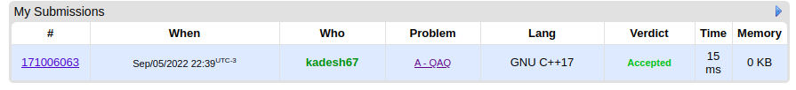

# Dynamic Programming Contest Problems

**Número da Lista**: 1<br>
**Conteúdo da Disciplina**: PD<br>
## Alunos

|Matrícula | Aluno |
| -- | -- |
| 18/0015834  | Eliseu Kadesh Rosa Assunção Júnior  |
| 18/0037242	| Rodrigo Tiago Costa Lima   |

## Sobre 

O objetivo deste projeto é resolver alguns problemas de programação utilizando algoritmos de programação dinâmica. Nós resolvemos 3 problemas distintos.

## Instalação 
**Linguagem**: C++<br>

## Pré-requisitos:

- g++ >= 9.4.0;
- make >= 4.2.1;

## Uso 

Existem dois arquivos para cada questão, um .cpp para a compilação e outro .txt em que há algum caso de teste designado para a questão.

Para rodar qualquer uma das questões, primeiro entre na pasta da questão.

```
  cd ./nomeDaQuestão
```

Depois usando make compile o código da questão

```
  make build
```

Agora execute a questão com o binário gerado com o caso de teste exemplo.

```
  make run
```

ou simplesmente compile e rode com um só comando

```
  make
```

## Love Song - [link](https://codeforces.com/problemset/problem/1539/B)

**Dificuldade: 800**

**Questão accepted**


## QAQ - [link](https://codeforces.com/contest/894/problem/A)

**Dificuldade: 800**

**Questão accepted**



## Long Jumps - [link](https://codeforces.com/problemset/problem/1472/C)

**Dificuldade: 1100**

**Questão accepted**


